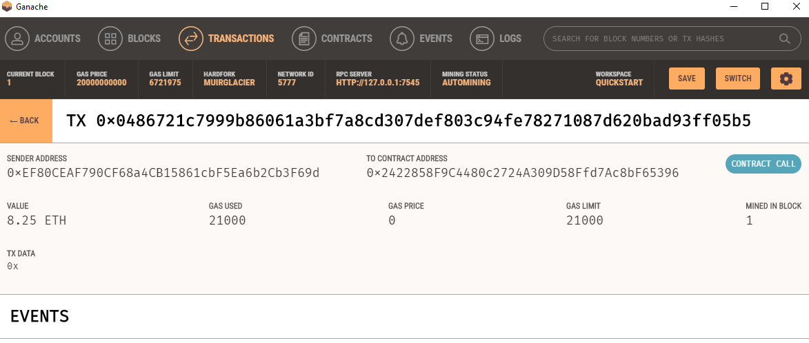

# fintech_finder
A web3 app that allows users to find and pay fintech professionals using the via the ethereum blockchain.

## Technologies

In this project we are utilizing Python 3, Streamlit, web3, bip44, and Ganache
Streamlit -- Open source framework to convert python scripts into shareable web apps
## Installation Guide

* Streamlit -- install via Pypi --  
 `pip install streamlit` in the command line  

 * web3 -- install via Pypi --  
 `pip install web3` in the command line  

 * bip44 -- install via Pypi --  
 `pip install bip44` in the command line  

 * Ganache --  
 Navigate to [Truffle suite / Ganache homepage](https://trufflesuite.com/ganache/) and follow installation instructions for your os.

 ## Usage

The usage of this app is very straight forward.  After navigating to the root of the project, simply run `streamlit run fintech_finder.py` from the command line to launch the Streamlit interface.  Make sure that you have created an .env file to include your mnemonic phrase from Ganache to interface with your accounts.  From the Streamlit interface you will be able to assess candidate fintech professionals profiles, calculate wages that would be owed based on hours worked and their wage rate, and then verify the transaction both via a hash displayed within Streamlit and also via your Ganache accounts and transactions pages.  Screenshots below for reference on the expected output from the app --  

###  Screenshot of account balance after transaction indicating wages paid --  

  

###  Screenshot of transaction details from transfer of funds --  

 

###  Screenshot of further transaction details from transfer of funds to fintech professional's account --  
  

## License

Licensed under the [MIT License](https://github.com/git/git-scm.com/blob/main/MIT-LICENSE.txt)  Copyright 2021 Dave Thomas.
